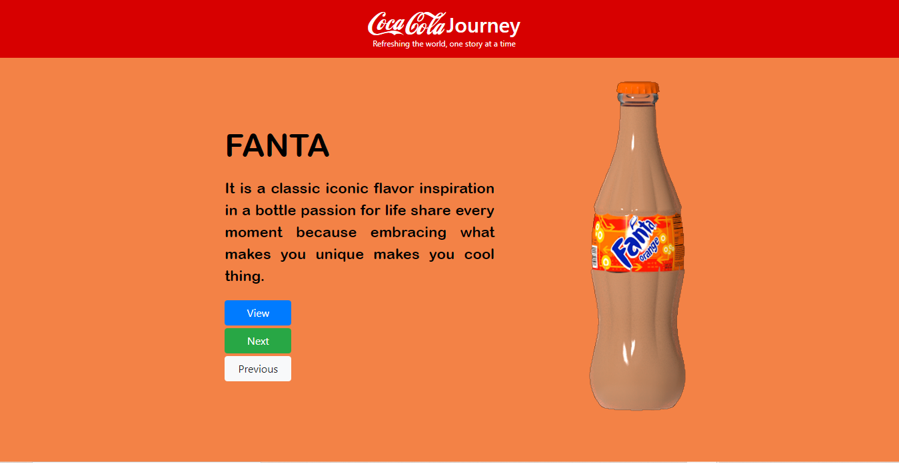
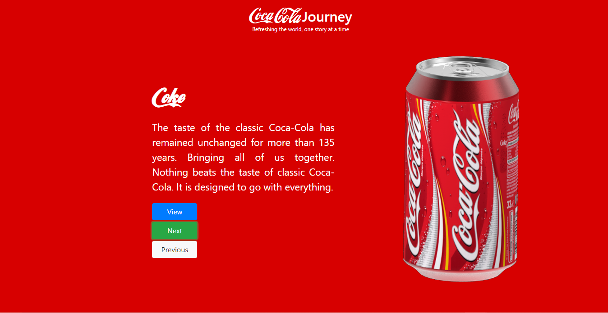
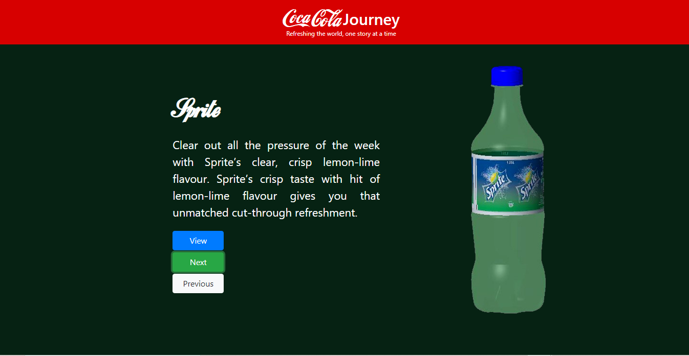
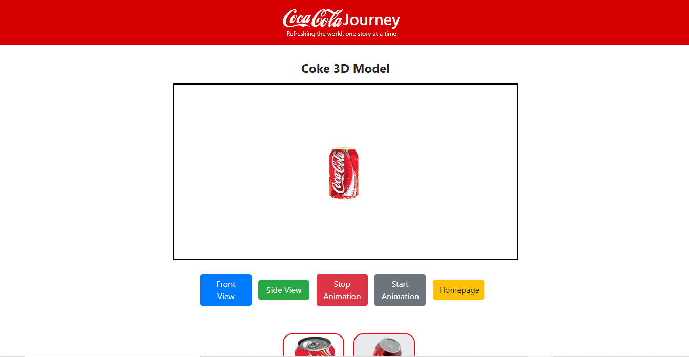
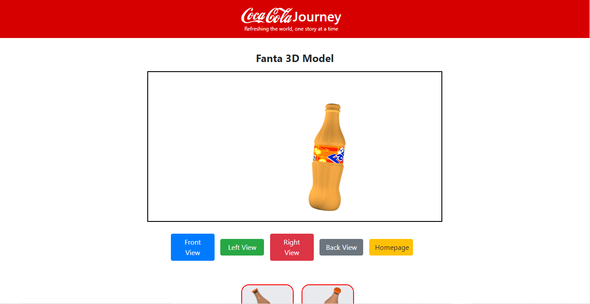
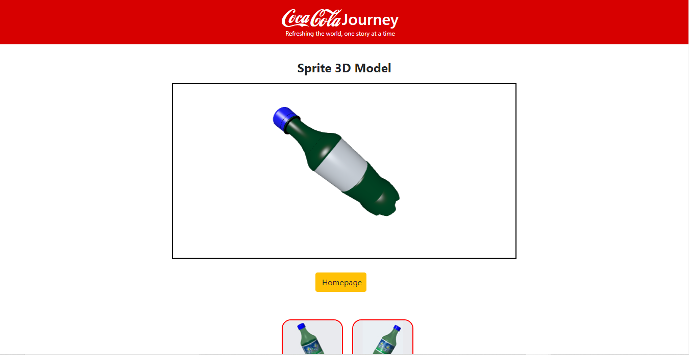

# Cocacola 3D App

Cocacola 3D App is a web application developed in PHP. The app demonstrates Fanta, Coke, and Sprite; three famous brands owned by the global beverages leader The Cocacola Company. The main purpose of the application is to demonstrate development and seemless integration of 3D content with the web applications.

## Website Features

Following are the salient features of the application:
MVC Architecture for efficient codebase management
Extensible 3D (X3D) Graphics utilization for seemless integration of 3D models into the web app
Responsive Web Design
Interactive 3D Models with multi camera views and motion effects
Effective Utilization of open source libraries like JQuery, Bootstrap, and x3d.js
SQLite Database for storage

## 3D Models

The app demonstrates 3D models for Fanta, Coke and Sprite brands. Each model were created in different software suites, with separate set of features and integrations. Two 3D Modelling software suites namely 3DS Max by Autodesk and Creo 6.0 by PTC were used for designing the models.

### Coke 3D Model
The Coke 3D Model was designed in 3DS Max with two camera views i.e., the front and the side camera views. The model was created so as do demonstrate the auto executable animation feature. Upon successful loading, the model displays an animated horizontal movement of the coke can. The same can be paused at will of the viewer.

### Fanta 3D Model
The Fanta 3D Model was designed in 3DS Max with four camera views i.e., front camera, back camera, left camera, and right camera. The model was designed to demonstrate touch sensor feature. The animation is played only when the model is clicked, in contrast to the coke 3d model which demonstrates auto execution of animation. Further, the movement of the model is vertical in nature.

### Sprite 3D Model
The Sprite 3D Model was designed in PTC Creo with single camera view without any animations integrated. The 3D model can be used to view the sprite bottle from different angles via interaction using mouse.

## Generating 3D Models

The 3D Models were exported in VRML format from the respective 3D Modelling Suites. The same were tested using [Instant Reality desktop application](https://www.instantreality.org/). Upon successful testing for the VRMLs, these were converted into X3D models using [Instant Reality online conversion utility](https://doc.instantreality.org/tools/x3d_encoding_converter/).

During the development process, the models were tested in HTML5 format also. For testing, the VRMLs were converted in HTML5 format.

You can view the website on:
https://users.sussex.ac.uk/~sz289/3dapp/assignment/index.php
https://cocacolawebsite.000webhostapp.com/
